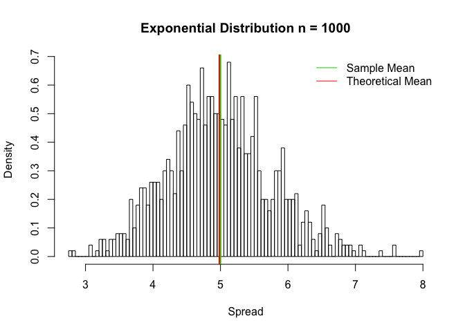
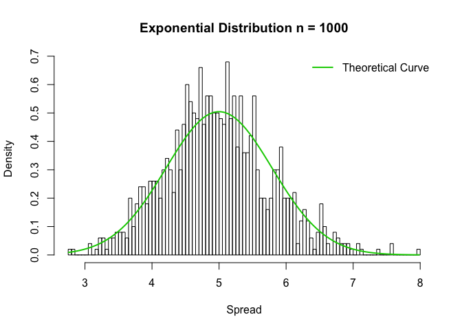
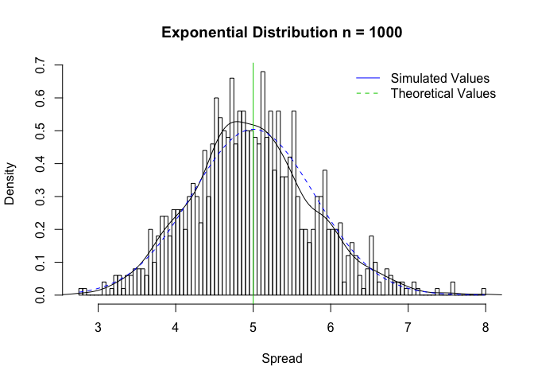
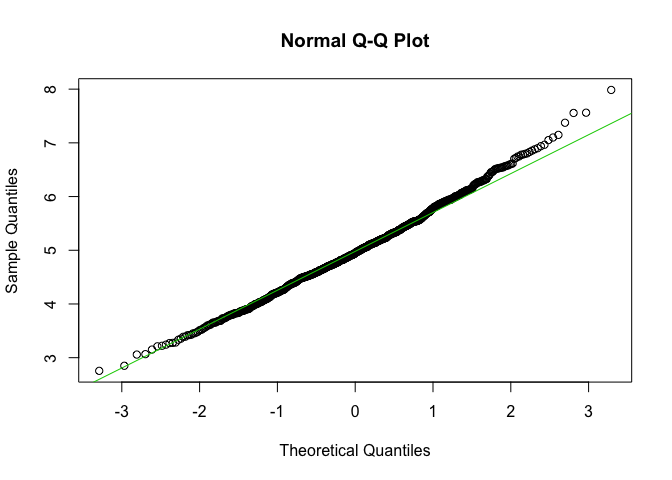

## Overview
In this project you will investigate the exponential distribution in R and compare it with the 
Central Limit Theorem. The exponential distribution can be simulated in R with rexp(n, lambda) 
where lambda is the rate parameter. The mean of exponential distribution is 1/lambda and the 
standard deviation is also 1/lambda. Set lambda = 0.2 for all of the simulations. You will investigate 
the distribution of averages of 40 exponentials. Note that you will need to do a thousand simulations.

Our results will: Illustrate via simulation and associated explanatory text the properties of the distribution of the mean of 40 exponentials. We shall:
       1. Show the sample mean and compare it to the theoretical mean of the distribution.
       2. Show how variable the sample is (via variance) and compare it to the theoretical variance of the distribution.
       3. Show that the distribution is approximately normal.
       
## Simulations

### Sample Mean vs Theoretical Mean
We will run a series of 1000 simulations to create a data set for comparison to theory. Each simulation will contain 40 observations and the expoential distribution function will be set to “rexp(40, 0.2)”.

Known values: lambda = 0.2, n = 40, simulations = 1000

```r
          lambda = 0.2
          n = 40 
          nosim = 1000

          set.seed(349)
```

The following code performs the simulations to collect necessary data, then plots the data:

```r
            exp_sim <- function(n, lambda)
            {
                      mean(rexp(n,lambda))
            }
            
            sim <- data.frame(ncol=2,nrow=1000)
            names(sim) <- c("Index","Mean")

            for (i in 1:nosim)
            {
                      sim[i,1] <- i
                      sim[i,2] <- exp_sim(n,lambda)
            }
```

### Mean of n = 1000

```r
        sample_mean <- mean(sim$Mean)
        sample_mean
```

```
## [1] 4.983227
```

### Theoretical exponential mean of exponential distribution

```r
        theor_mean <- 1/lambda
        theor_mean
```

```
## [1] 5
```

The simulation mean of 4.983227 is close to the theoretical value of 5. 

Histogram plot of the exponential distribution n = 1000

```r
          hist(sim$Mean, 
                 breaks = 100, 
                 prob = TRUE, 
                 main="Exponential Distribution n = 1000", 
                 xlab="Spread")
                        abline(v = theor_mean, 
                                col= 3,
                                lwd = 2)
                        abline(v = sample_mean, 
                                col = 2,
                                lwd = 2)

                legend('topright', c("Sample Mean", "Theoretical Mean"), 
                                bty = "n",       
                                lty = c(1,1), 
                                col = c(col = 3, col = 2))
```

<!-- -->

## Sample Variance vs Theoretical Population Variance
We now turn our attention to the variance. We will compare the variance present in the sample means of the 1000 simulations to the theoretical varience of the population.

The variance of the sample means estimates the variance of the population by using the varience of the 1000 entries in the means vector times the sample size, 40. That is, σ2=Var(samplemeans)×N.

```r
              sample_var <- var(sim$Mean)
              theor_var <- ((1/lambda)^2)/40
```

The theoretical variance of the population is given by σ2=(1/lambda)2.

```r
              sample_var
```

```
## [1] 0.6010593
```

```r
              theor_var
```

```
## [1] 0.625
```


```r
          hist(sim$Mean, 
                        breaks = 100, 
                        prob = TRUE, 
                        main = "Exponential Distribution n = 1000", 
                        xlab = "Spread")
                        xfit <- seq(min(sim$Mean), max(sim$Mean), length = 100)
                        yfit <- dnorm(xfit, mean = 1/lambda, sd = (1/lambda/sqrt(40)))
                        lines(xfit, yfit, pch = 22, col = 3, lwd = 2)
                        legend('topright', c("Theoretical Curve"), 
                        lty = 1,lwd = 2, bty = "n", col = 3)
```

<!-- -->


```r
          hist(sim$Mean, 
                        breaks = 100, 
                        prob = TRUE, 
                        main = "Exponential Distribution n = 1000", 
                        xlab = "Spread")
                        lines(density(sim$Mean))
                        abline(v = 1/lambda, col = 3)
                        xfit <- seq(min(sim$Mean), max(sim$Mean), length = 100)
                        yfit <- dnorm(xfit, mean = 1/lambda, sd = (1/lambda/sqrt(40)))
                        lines(xfit, yfit, pch = 22, col = 4, lty = 2)
                        legend('topright', c("Simulated Values", "Theoretical Values"), 
                        bty = "n", lty = c(1,2), col = c(4, 3))
```

<!-- -->

## Show that the distribution is approximately normal.

Due to the central limit theorem, the averages of samples follow normal distribution. The figure above also shows the density computed using the histogram and the normal density plotted with theoretical mean and variance values. Also, the q-q plot below suggests the normality. The theoretical quantiles again match closely with the actual quantiles. These four methods of comparison prove that the distribution is approximately normal.


```r
            qqnorm(sim$Mean, 
                            main ="Normal Q-Q Plot")
                            qqline(sim$Mean, 
                            col = "3")
```

<!-- -->
